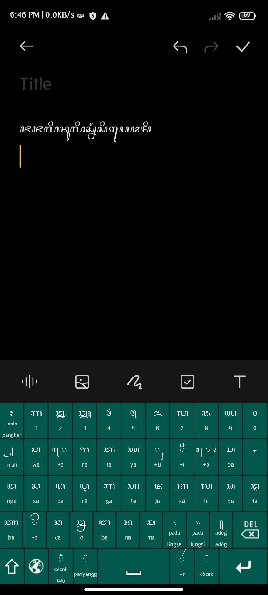
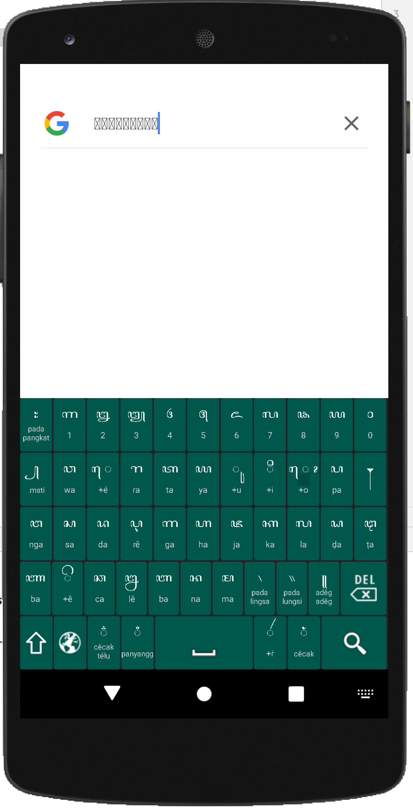
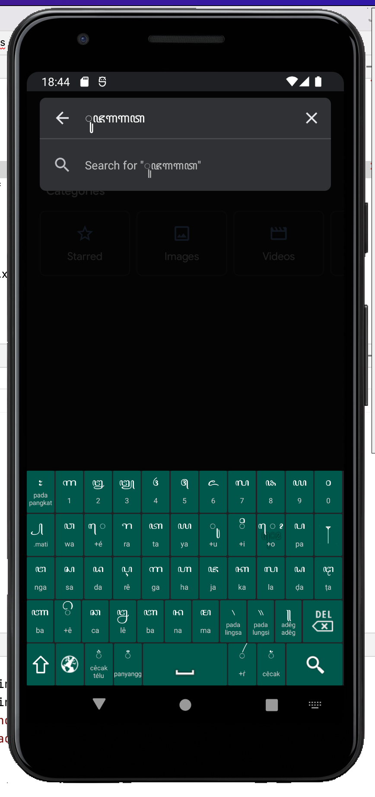

# Keyboard Layout Aksara Jawa
Keyboard Layout aksara Jawa untuk Android. Terbikin pakai Java.

Prolog
-----
Keyboard layout aksara jawa untuk Android sudah banyak di playstore, tetapi saya ingin mengembangkan agar ada predictive textnya. Namun ambisi saya ini sepertinya kepentok dengan pekerjaan yang belum nampak ujung selonya, jadi sementara saya release dulu versi alpha dari layout ini.

Ujicoba
-----
Saat ini keyboard layout ini baru lancar di hape xiaomi, emulator nexus dan emulator google pixel. Ada issue di hp samsung, sepertinya sudah saya perbaiki, namun jika Anda menemukan error, silakan submit di laman issue. Mohon diberi keterangan versi HP, dan proses errornya. Terimakasih.

